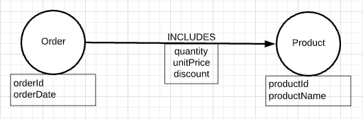

= Neo4j Code Wars Application

This repository accompanies the repositories listed below to connect to Neo4j running in a Docker container and query Northwind sales domain data in the database.

* https://github.com/JMHReif/docker-neo4j[Docker container for Neo4j^]
* https://github.com/JMHReif/code-wars-import-data-scripts[Northwind data set load scripts^]

== Data

An example of the data model showing how the data is organized in the database is shown below.

== REST endpoints

* localhost:8082/orders/findbyid?orderId=10564
* localhost:8082/orders/findbyproduct?productName=choco
* localhost:8082/orders/findbyproduct?productName=coffee
* localhost:8082/orders/findbyproduct?productName=chocolade

== Presentation

PDF version of accompanying presentation is published to SpeakerDeck.

* https://speakerdeck.com/jmhreif/code-wars-database-decisions-for-application-development[Code Wars: Database Decisions for Application Development^]

== Related projects

* https://github.com/JMHReif?tab=repositories&q=code-wars&type=&language=&sort=[Code Wars applications and import repositories^]